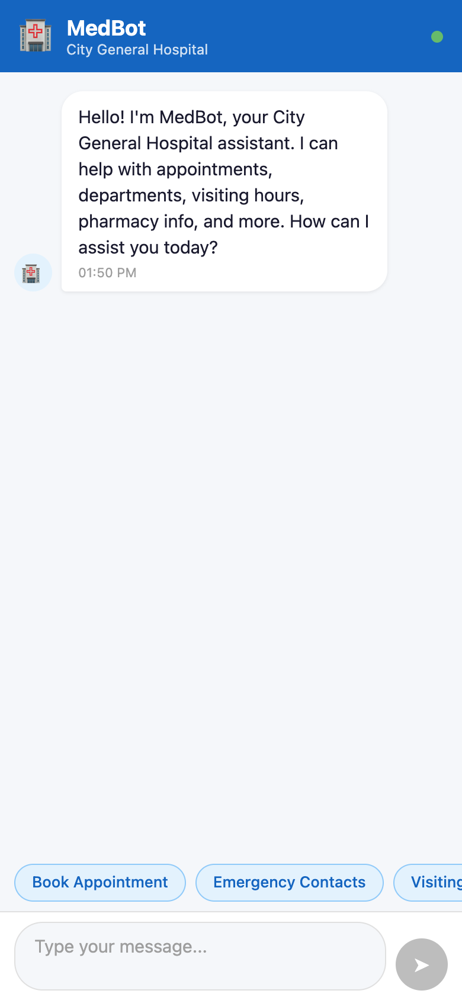
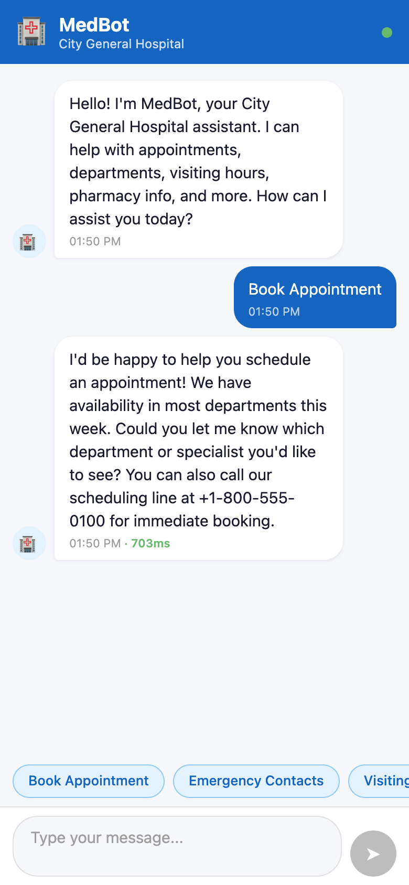
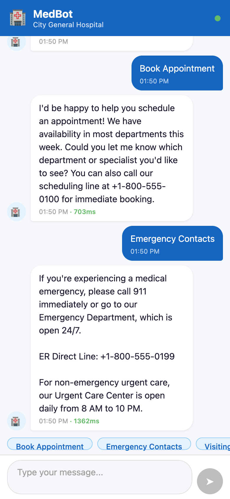
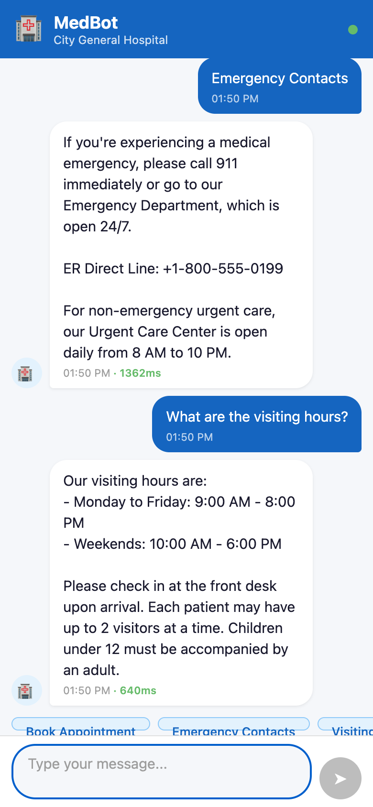
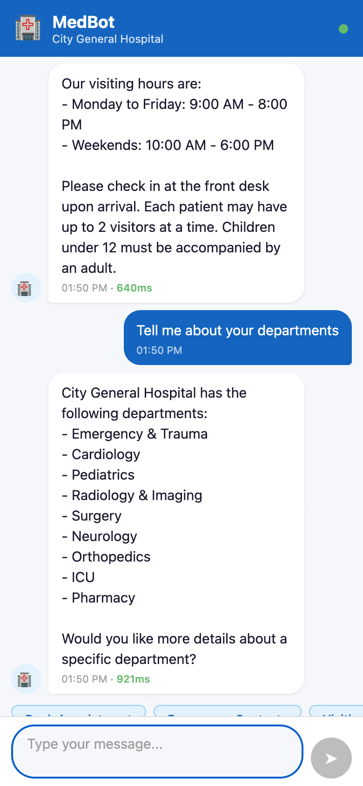
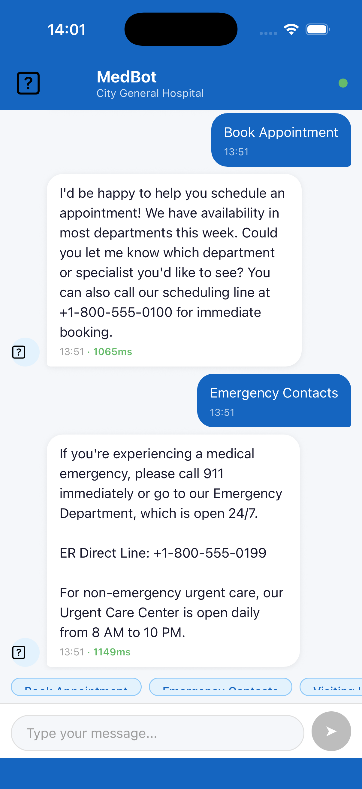

# MedBot - Hospital Assistant Chatbot

A React Native (Expo) chatbot app for City General Hospital. MedBot helps patients and visitors with appointment scheduling, department info, visiting hours, pharmacy details, emergency contacts, and billing inquiries.

## Screenshots

### Web

| Welcome | Appointment | Emergency |
|---------|------------|-----------|
|  |  |  |

| Visiting Hours | Departments |
|---------------|-------------|
|  |  |

### iOS



## Features

- AI-powered chat using Claude API (Anthropic)
- Built-in mock mode for offline development and demo
- Quick reply buttons for common questions
- Animated typing indicator
- Conversation history support
- Cross-platform: iOS, Android, and Web

## Tech Stack

- React Native 0.76 + Expo SDK 52
- TypeScript
- Claude API (Haiku model)

## Getting Started

### Prerequisites

- Node.js 18+
- Expo CLI (`npm install -g expo-cli`)

### Installation

```bash
npm install
```

### Configuration

Copy the example environment file and add your API key:

```bash
cp .env.example .env
```

Edit `.env` and set your Claude API key:

```
EXPO_PUBLIC_CLAUDE_API_KEY=your_api_key_here
```

> The app runs in **mock mode** by default, so an API key is not required for testing.

### Running

```bash
npx expo start
```

Then press `i` for iOS simulator, `a` for Android emulator, or `w` for web.

## Project Structure

```
├── App.tsx                     # App entry point
├── src/
│   ├── components/
│   │   ├── ChatBubble.tsx      # Message bubble component
│   │   ├── QuickReplies.tsx    # Quick reply chips
│   │   └── TypingIndicator.tsx # Animated typing dots
│   ├── models/
│   │   └── message.ts          # Message type definition
│   ├── screens/
│   │   └── ChatScreen.tsx      # Main chat screen
│   └── services/
│       └── claudeService.ts    # Claude API + mock service
├── app.json                    # Expo config
├── package.json
└── tsconfig.json
```

## Mock Mode

The app includes a mock response system (`USE_MOCK = true` in `claudeService.ts`) that provides realistic responses without needing an API key. Toggle `USE_MOCK` to `false` to use the live Claude API.

## License

MIT
